# Kubernetes CKA Lab

> A self-managed Kubernetes cluster built from scratch on bare metal ESXi using kubeadm. Covers all five CKA exam domains with hands-on implementation, and real troubleshooting documentation.

---

## The Lab

```
Hypervisor      VMware ESXi (bare metal, Type 1)
OS              Ubuntu 24.04 LTS
Kubernetes      v1.31.14 via kubeadm
Runtime         containerd (SystemdCgroup = true)
CNI             Calico v3.27.0
Pod CIDR        10.244.0.0/16
Service CIDR    10.96.0.0/12

kmaster     192.168.86.58    Control Plane   2 vCPU / 4GB RAM
kworker1    192.168.86.213   Worker Node     2 vCPU / 2GB RAM
kworker2    192.168.86.248   Worker Node     2 vCPU / 2GB RAM
```



---

## Why kubeadm and Not a Managed Service?

EKS, GKE, and AKS hide the control plane. etcd, kubelet, the scheduler, the API server -- you never touch them. For CKA prep and for understanding Kubernetes at an operational level, that is a gap.

kubeadm exposes every layer. When something breaks you diagnose it at the component level. That is what the CKA Troubleshooting domain tests and what matters in production self-managed environments.

The same cluster architecture is reproduced as infrastructure-as-code in `terraform/` for AWS EC2, demonstrating cloud portability without sacrificing operational depth.

---

## CKA Domain Coverage

| Domain | Weight | Status |
|---|---|---|
| Cluster Architecture, Installation & Configuration | 25% | In Progress |
| Workloads & Scheduling | 15% | Pending |
| Services & Networking | 20% | Pending |
| Storage | 10% | Pending |
| Troubleshooting | 30% | In Progress |

---

## Repository Structure

```
├── docs/
│   ├── 01-lab-setup/             Full cluster build guide with all commands and decisions
│   ├── 02-cka-domains/           Study notes and practice labs by exam domain
│   └── 03-troubleshooting-logs/  Real errors encountered, root cause analysis, and fixes
├── projects/                     Architecture write-ups with NIST 800-53 mapping
├── terraform/                    AWS EC2 cluster equivalent via OpenTofu
└── assets/                       Architecture diagrams and verification screenshots
```

---


## Notes

Technical write-ups from this project are published at [notesbynisha.com](https://notesbynisha.com)