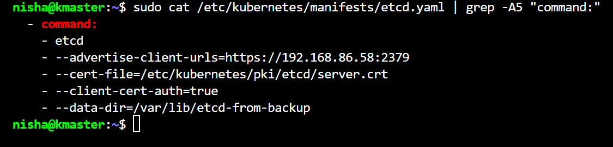
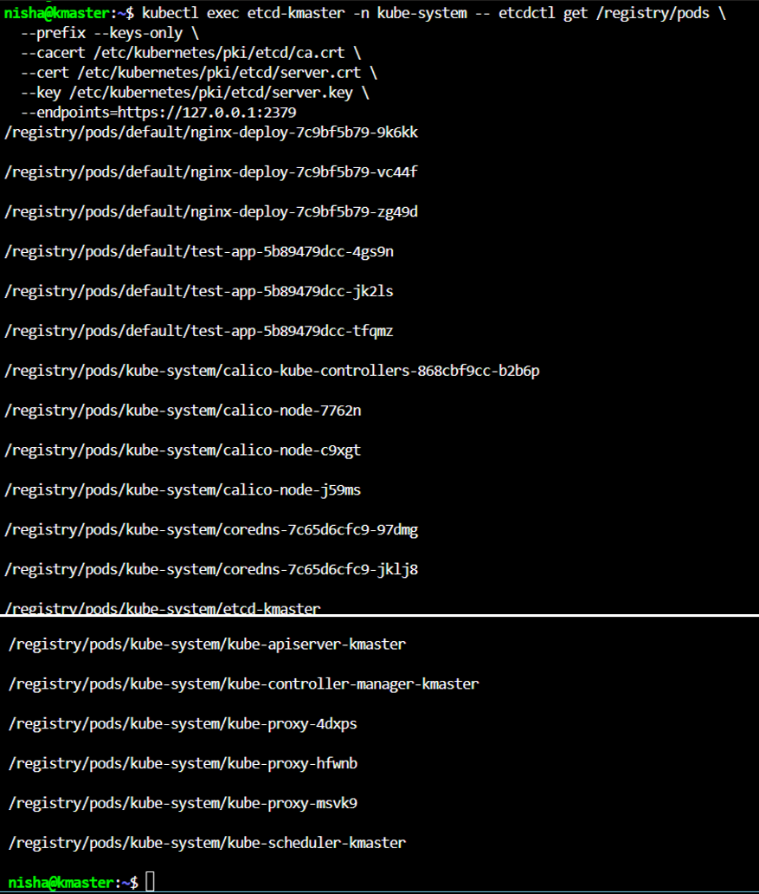
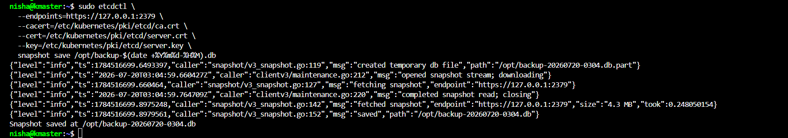
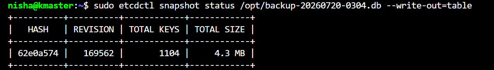
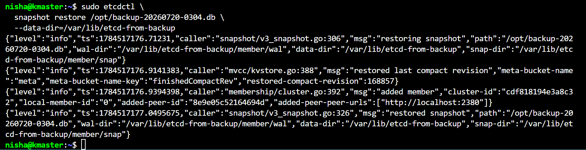
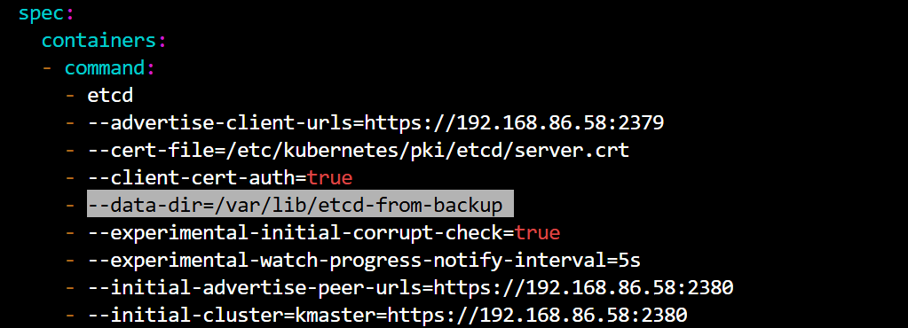
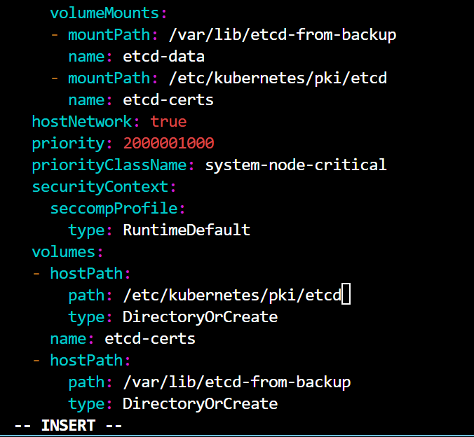
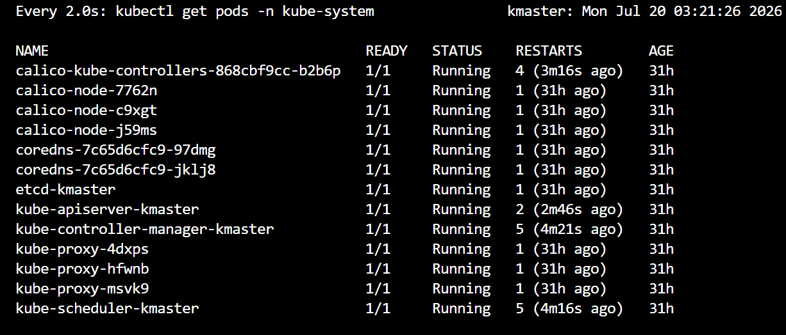
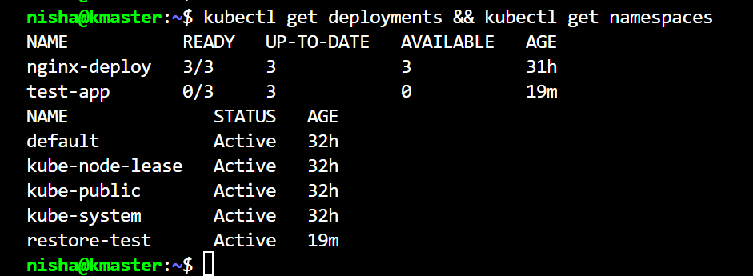

# Cluster Architecture, Installation & Configuration (25%)

## Contents

- [Exam Objectives](#exam-objectives)
- [Control Plane Components](#control-plane-components)
- [Worker Node Components](#worker-node-components)
- [Key Commands](#key-commands)
  - [Cluster Info](#cluster-info)
  - [Control Plane Pods](#control-plane-pods)
  - [RBAC](#rbac)
  - [kubeadm Cluster Lifecycle](#kubeadm-cluster-lifecycle)
  - [etcd Backup and Restore](#etcd-backup-and-restore-heavily-tested)
    - [Version Reference](#version-reference)
    - [Tool Selection](#tool-selection)
    - [Cert Paths](#cert-paths-memorize-these)
    - [Inspect etcd Keys Directly](#inspect-etcd-keys-directly)
    - [Backup](#backup)
    - [Verify the Snapshot](#verify-the-snapshot)
    - [Restore: Approach 1](#restore-approach-1-official-recommendation-stop-api-server-first)
    - [Restore: Approach 2](#restore-approach-2-without-stopping-api-server)
    - [When to Use Which Approach](#when-to-use-which-approach)
    - [Critical Gotchas](#critical-gotchas)
    - [NIST 800-53 Mapping](#nist-800-53-mapping)
- [Extension Interfaces](#extension-interfaces)
- [Lab Notes](#lab-notes)

---

## Exam Objectives

- Manage role based access control (RBAC)
- Prepare underlying infrastructure for installing a Kubernetes cluster
- Create and manage Kubernetes clusters using kubeadm
- Manage the lifecycle of Kubernetes clusters
- Implement and configure a highly-available control plane
- Use Helm and Kustomize to install cluster components
- Understand extension interfaces (CNI, CSI, CRI, etc.)
- Understand CRDs, install and configure operators

---

## Control Plane Components

| Component | Role | Location |
|---|---|---|
| kube-apiserver | All cluster communication goes through this | kmaster |
| etcd | Key-value store for all cluster state | kmaster |
| kube-scheduler | Assigns pods to nodes | kmaster |
| kube-controller-manager | Reconciles desired vs actual state | kmaster |

## Worker Node Components

| Component | Role |
|---|---|
| kubelet | Agent that runs on every node, executes pod specs |
| kube-proxy | Manages network rules for service routing |
| Container runtime | Runs the actual containers (containerd in this lab) |

---

## Key Commands

### Cluster Info
```bash
kubectl cluster-info
kubectl get nodes
kubectl get nodes -o wide
kubectl describe node kmaster
```

### Control Plane Pods
```bash
kubectl get pods -n kube-system
kubectl describe pod kube-apiserver-kmaster -n kube-system
```

### RBAC
```bash
# Create a role
kubectl create role pod-reader --verb=get,list,watch --resource=pods

# Create a rolebinding
kubectl create rolebinding pod-reader-binding \
  --role=pod-reader \
  --user=nisha

# Check permissions
kubectl auth can-i list pods --as=nisha

# View all rolebindings
kubectl get rolebindings -A
kubectl get clusterrolebindings -A
```

### kubeadm Cluster Lifecycle
```bash
# Check upgrade plan
kubeadm upgrade plan

# Apply upgrade (control plane)
kubeadm upgrade apply v1.32.0

# Upgrade worker node
kubeadm upgrade node

# Generate new join command
kubeadm token create --print-join-command
```

---

### etcd Backup and Restore (Heavily Tested)

Official reference: https://kubernetes.io/docs/tasks/administer-cluster/configure-upgrade-etcd/

etcd is the cluster database. All objects (pods, deployments, secrets, RBAC
bindings) live here. Losing etcd means losing all cluster state since the
last backup. Backup and restore appear on every CKA exam.

---

#### Version Reference

| Environment | Kubernetes | etcd |
|---|---|---|
| This lab | v1.31.14 | v3.5.24 |
| CKA exam (current) | v1.35 | v3.6.x |

The exam environment runs etcd v3.6.x. Tool deprecations that began in v3.5
are slated for removal in v3.6. Use `etcdutl` for restore and status on both
the exam and in this lab.

---

#### Tool Selection

| Operation | Tool | Notes |
|---|---|---|
| `snapshot save` | `etcdctl` | Current, no change |
| `snapshot status` | `etcdutl` | `etcdctl status` deprecated in v3.5, removed in v3.6 |
| `snapshot restore` | `etcdutl` | `etcdctl restore` deprecated in v3.5, removed in v3.6 |

On the exam cluster, confirm both tools are available before starting any
etcd task:

```bash
which etcdctl && which etcdutl
```

If either is missing, refer to the install procedure in
`projects/01-kubeadm-cluster-build.md`.

---

#### Cert Paths (Memorize These)

| What | Path |
|---|---|
| CA cert | `/etc/kubernetes/pki/etcd/ca.crt` |
| Server cert | `/etc/kubernetes/pki/etcd/server.crt` |
| Server key | `/etc/kubernetes/pki/etcd/server.key` |
| Endpoint | `https://127.0.0.1:2379` |

Verify cert paths from the static pod manifest if unsure:
```bash
sudo cat /etc/kubernetes/manifests/etcd.yaml | grep -A5 "command:"
```

<!-- SCREENSHOT: etcd-01-cert-paths.png -->
<!-- Shows: grep output from etcd.yaml displaying cert-file path and data-dir -->


---

#### Inspect etcd Keys Directly

etcd v3.5+ runs on a distroless image with no shell, no cat, and no tar. The
`sh -c` wrapper fails with "executable file not found." Call etcdctl directly
without a shell wrapper.

```bash
kubectl exec etcd-kmaster -n kube-system -- etcdctl get /registry/pods \
  --prefix --keys-only \
  --cacert /etc/kubernetes/pki/etcd/ca.crt \
  --cert /etc/kubernetes/pki/etcd/server.crt \
  --key /etc/kubernetes/pki/etcd/server.key \
  --endpoints=https://127.0.0.1:2379
```

<!-- SCREENSHOT: etcd-02-keys.png -->
<!-- Shows: kubectl exec output listing /registry/pods/... and /registry/namespaces/... keys -->


---

#### Backup

There are two backup methods. The snapshot method is what the CKA exam tests.
The file-level method is an operational alternative for offline scenarios.

| Method | Tool | etcd Running? | Output | CKA Exam |
|---|---|---|---|---|
| Snapshot backup | `etcdctl snapshot save` | Yes, live | `.db` snapshot file | Yes, this is tested |
| File-level backup | `etcdutl backup` | No, offline | Raw data and WAL files | No |

**Method 1: Snapshot Backup (CKA exam method)**

Always use ETCDCTL_API=3. Inline it per command on the exam to avoid state
issues across terminal tabs.

```bash
sudo etcdctl \
  --endpoints=https://127.0.0.1:2379 \
  --cacert=/etc/kubernetes/pki/etcd/ca.crt \
  --cert=/etc/kubernetes/pki/etcd/server.crt \
  --key=/etc/kubernetes/pki/etcd/server.key \
  snapshot save /opt/etcd-backup.db
```

<!-- SCREENSHOT: etcd-03-snapshot-save.png -->
<!-- Shows: JSON log output ending in "Snapshot saved at /opt/etcd-backup.db" with size and timing -->


**Method 2: File-level Backup (offline only)**

Used when etcd is not running. Copies the raw data directory and WAL files
to a backup location. etcd must be stopped first or the files may be in an
inconsistent state.

```bash
etcdutl backup \
  --data-dir /var/lib/etcd \
  --backup-dir /backup/etcd-backup
```

To restore from a file-level backup, copy the backup contents back into
`/var/lib/etcd` and restart etcd. No snapshot restore command is needed.

---

#### Verify the Snapshot

```bash
sudo etcdutl --write-out=table snapshot status /opt/etcd-backup.db
```

A valid snapshot shows all four fields populated. A corrupted or incomplete
snapshot either fails this command or shows a size mismatch.

Note: `etcdctl snapshot status` still works on etcd v3.5.x but prints a
deprecation warning and is removed in v3.6. Use `etcdutl` for both lab
and exam.

<!-- SCREENSHOT: etcd-04-snapshot-status.png -->
<!-- Shows: table output with HASH, REVISION, TOTAL KEYS, TOTAL SIZE columns populated -->


---

#### Restore: Approach 1 (Official Recommendation: Stop API Server First)

The official Kubernetes documentation states: if any API servers are running
in your cluster, you should not attempt to restore instances of etcd. This is
the recommended default procedure for all restore scenarios.

**Step 1: Stop the API server and etcd by moving their manifests out**

```bash
sudo mv /etc/kubernetes/manifests/kube-apiserver.yaml /tmp/
sudo mv /etc/kubernetes/manifests/etcd.yaml /tmp/
```

**Step 2: Confirm both containers have stopped**

```bash
sudo crictl ps
```

Wait until neither `kube-apiserver` nor `etcd` appears in the output.
This typically takes 15-30 seconds.

**Step 3: Check the exact backup filename**

```bash
ls -lh /opt/backup-*.db
```

Use the exact filename in the restore command. Do not rely on `$(date)` because
it evaluates to the current time, not the backup time.

**Step 4: Run the restore**

The `--data-dir` flag specifies a new directory that will be created during
the restore process. No certs needed. The restore reads the snapshot file
locally.

```bash
sudo etcdutl --data-dir /var/lib/etcd-restored snapshot restore /opt/etcd-backup.db
```

<!-- SCREENSHOT: etcd-05-snapshot-restore.png -->
<!-- Shows: etcdutl restore log output confirming path, wal-dir, data-dir, snap-dir, and "restored snapshot" -->


**Step 5: Update the etcd manifest in both places before moving it back**

```bash
sudo vi /tmp/etcd.yaml
```

Use find and replace in vi to catch both lines at once:
```
:%s/\/var\/lib\/etcd$/\/var\/lib\/etcd-restored/g
```

Place 1: the `--data-dir` flag under `spec.containers.command`:

```yaml
- --data-dir=/var/lib/etcd-restored
```

<!-- SCREENSHOT: etcd-06-manifest-command.png -->
<!-- Shows: vi with --data-dir=/var/lib/etcd-restored highlighted under command section -->


Place 2: the `hostPath.path` under `spec.volumes`:

```yaml
  - hostPath:
      path: /var/lib/etcd-restored
    name: etcd-data
```

<!-- SCREENSHOT: etcd-07-manifest-volume.png -->
<!-- Shows: vi with hostPath.path=/var/lib/etcd-restored updated under volumes section -->


Missing the hostPath update is the most common restore failure. etcd starts
but reads from the wrong directory. Symptom: etcd-kmaster absent from pod
list, kube-scheduler shows 0/1.

Save and exit:
```
:wq
```

**Step 6: Move both manifests back**

```bash
sudo mv /tmp/etcd.yaml /etc/kubernetes/manifests/
sudo mv /tmp/kube-apiserver.yaml /etc/kubernetes/manifests/
```

kubelet detects the manifests and starts both containers immediately.

**Step 7: Wait for everything to come back**

```bash
watch kubectl get pods -n kube-system
```

Wait for `etcd-kmaster` and `kube-apiserver-kmaster` to show `1/1 Running`.

**Step 8: Restart additional control plane components**

The official Kubernetes documentation recommends restarting kube-scheduler,
kube-controller-manager, and kubelet after a restore to ensure they do not
rely on stale data. In practice they restart themselves when they lose leader
lock during the restore, but an explicit restart confirms clean state.

```bash
sudo systemctl restart kubelet
```

The scheduler and controller manager are static pods and will restart
automatically when etcd and the API server are back. Verify all components
are healthy:

```bash
kubectl get pods -n kube-system
```

**Step 9: Verify restore succeeded**

```bash
kubectl get deployments && kubectl get namespaces
```

Objects that existed at snapshot time should be back. Anything created after
the snapshot was taken is permanently lost. This is your RPO boundary.

<!-- SCREENSHOT: etcd-08-post-restore-pods.png -->
<!-- Shows: watch kubectl get pods -n kube-system with all pods 1/1 Running including etcd-kmaster -->


<!-- SCREENSHOT: etcd-09-restore-verify.png -->
<!-- Shows: kubectl get deployments listing test-app, kubectl get namespaces listing restore-test -->


---

#### Restore: Approach 2 (Shortcut, Healthy Cluster Only)

On a healthy cluster restoring to a new data directory, you can skip stopping
the API server and update the live etcd manifest directly. This is faster and
commonly seen in KodeKloud labs and killer.sh scenarios, but is not the
official recommendation. Use Approach 1 as the default.

```bash
# Check exact backup filename
ls -lh /opt/backup-*.db

# Restore to new data directory
sudo etcdutl --data-dir /var/lib/etcd-restored snapshot restore /opt/etcd-backup.db

# Update etcd.yaml in both places (live manifest, not /tmp)
sudo vi /etc/kubernetes/manifests/etcd.yaml
# :%s/\/var\/lib\/etcd$/\/var\/lib\/etcd-restored/g

# Wait for etcd to restart (API server will timeout briefly, this is normal)
watch kubectl get pods -n kube-system

# Verify
kubectl get deployments && kubectl get namespaces
```

---

#### When to Use Which Approach

| Situation | Approach |
|---|---|
| Default for all restore scenarios | Approach 1 (official recommendation) |
| Cluster is degraded or API server unresponsive | Approach 1 required |
| Restoring to the same data directory | Approach 1 required |
| Healthy cluster, new data directory, time pressure | Approach 2 (shortcut, works in practice) |

---

#### Critical Gotchas

1. Snapshot order matters. Correct drill sequence:
   `create --> backup --> delete --> restore --> verify`

2. Two-place edit in etcd.yaml: both `--data-dir` flag and
   `volumes.hostPath.path` must point to the new directory.

3. etcd distroless image: no shell, no cat, no tar in etcd v3.5+
   containers. Drop the `sh -c` wrapper and call etcdctl directly.

4. API version: always use ETCDCTL_API=3 with etcdctl for snapshot save.
   Inline per command on the exam:
   `sudo ETCDCTL_API=3 etcdctl snapshot save ...`
   etcdutl does not require the API version flag.

5. Restore file naming: use `ls -lh /opt/backup-*.db` to confirm the
   exact filename before running restore.

6. Tool availability: run `which etcdctl && which etcdutl` before starting
   any etcd task on the exam cluster. If either is missing, use the tarball
   install procedure in projects/01-kubeadm-cluster-build.md.

7. etcd v3.6 on CKA exam: the exam runs Kubernetes v1.35 with etcd
   v3.6.x. etcdctl restore and etcdctl status are removed in v3.6. Use
   etcdutl for both. etcdctl snapshot save still works.

---

#### NIST 800-53 Mapping

| Control | Maps To |
|---|---|
| CP-9 Information System Backup | etcd snapshot save procedure |
| CP-10 Information System Recovery | etcd snapshot restore procedure |
| RPO | Backup frequency determines data loss window |
| RTO | Restore + manifest update + etcd restart time |

---

## Extension Interfaces

| Interface | Purpose | Example |
|---|---|---|
| CRI | Container Runtime Interface | containerd, CRI-O |
| CNI | Container Network Interface | Calico, Flannel, Cilium |
| CSI | Container Storage Interface | AWS EBS, NFS |

---

## Lab Notes

- This lab uses containerd as the CRI
- Calico is the CNI plugin (pod CIDR: 10.244.0.0/16, patched from Calico default of 192.168.0.0/16)
- kubeadm version: v1.31.14
- etcd version: v3.5.24 (lab) / v3.6.x (CKA exam environment on Kubernetes v1.35)
- etcd image is distroless with no shell, no tar, and no cat available inside the container
- etcdctl and etcdutl installed at /usr/local/bin/ in this lab. See projects/01-kubeadm-cluster-build.md for the install procedure. Tool availability on exam clusters is not explicitly documented by the Linux Foundation and should be verified with `which etcdctl && which etcdutl` at the start of any etcd task.
- Control plane taint: node-role.kubernetes.io/control-plane:NoSchedule
