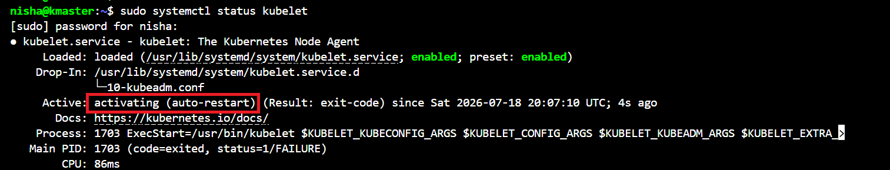
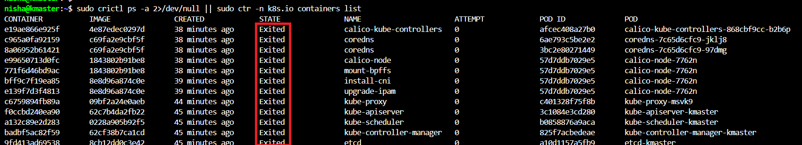
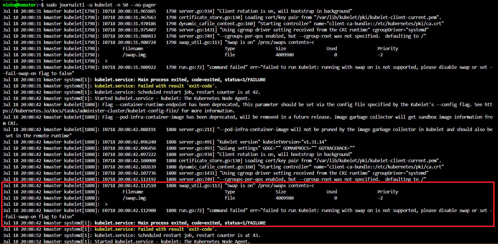

# Lab Build Troubleshooting Log

Real errors encountered during lab setup, documented for reference.

---

## Error 1: netplan Permissions Warning

**When:** Phase 2, setting static IPs

**Error:**
```
WARNING: Permissions for /etc/netplan/00-installer-config.yaml are too open.
Netplan configuration should NOT be accessible by others.
```

**Cause:** Default file permissions were too permissive after editing.

**Fix:**
```bash
sudo chmod 600 /etc/netplan/00-installer-config.yaml
sudo netplan apply
```

**Lesson:** Netplan config files must be owner-readable only (600). This is a
security requirement, not just a preference.

---

## Error 2: netplan Invalid YAML

**When:** Phase 2, kmaster static IP configuration

**Error:**
```
/etc/netplan/00-installer-config.yaml:10:10: Invalid YAML: did not find expected '-' indicator:
         via: 192.168.86.1
         ^
```

**Cause:** YAML indentation error. The `via` key was not properly nested under
the routes list item.

**Fix:** The `to` and `via` keys must be at the same indentation level, both
under the `- ` list item:

```yaml
routes:
  - to: default
    via: 192.168.86.1
```

**Lesson:** YAML is indentation-sensitive. Use spaces only, never tabs.
Two spaces per level is the standard for Kubernetes manifests.

---

## Error 3: conntrack Not Found

**When:** Phase 9, kubeadm init on kmaster

**Error:**
```
error execution phase preflight: [preflight] Some fatal errors occurred:
        [ERROR FileExisting-conntrack]: conntrack not found in system path
```

**Cause:** The `conntrack` package was not installed on Ubuntu 24.04 by default.
kubeadm requires it for network connection tracking.

**Fix:**
```bash
sudo apt-get install -y conntrack
```

Then re-run kubeadm init.

**Lesson:** Ubuntu 24.04 has a slightly leaner default package set than 22.04.
Always install conntrack before running kubeadm init.

---

## Error 4: Paste Formatting Issue in Terminal

**When:** Phase 6, kworker2

**Error:**
```
[200~sudo: command not found
```

**Cause:** VS Code terminal injected bracket paste mode characters (`[200~`)
around pasted text. This is a terminal escape sequence that some terminals
interpret differently.

**Fix:** No action needed. The command recovered and ran correctly. Can be
prevented by pasting one line at a time or using VS Code's paste shortcut.

**Lesson:** When pasting multi-line commands into a terminal, watch for
bracket artifacts. If a command fails this way, just retype or paste it again.


---

## Error 5: Swap Re-enables After Reboot, kubelet Fails to Start

**When:** Post-rebuild, after rebooting all 3 nodes to apply netplan changes

**Error:**

```
"Swap is on" /proc/swaps contents=
Filename: /swap.img   Type: file   Size: 4009980
err="failed to run Kubelet: running with swap on is not supported"
```

**Symptoms:**
- kubectl commands return: "connection to server was refused"
- kubelet shows: activating (auto-restart) with exit-code failure
- All control plane containers in Exited state (crictl ps -a)
- Restart counter incrementing rapidly (counter was at 50+)

**Diagnosis screenshots:**


*kubelet activating (auto-restart) with exit-code failure*


*API server unreachable - kubectl cannot connect*


*All control plane containers in Exited state*


*Root cause: swap re-enabled after reboot, kubelet refuses to start*

**Diagnosis commands:**
```bash
sudo systemctl status kubelet
sudo journalctl -u kubelet -n 50 --no-pager
free -h
```

**Root cause:**
`swapoff -a` disables swap for the current session only. The original lab
setup ran `swapoff -a` but never removed the swap entry from `/etc/fstab`.
On reboot, Ubuntu reads fstab and re-enables the swap file (/swap.img).
kubelet detects swap and refuses to start.

**Fix:**
```bash
# Disable swap immediately in current session
sudo swapoff -a

# Remove swap entry permanently from fstab
sudo sed -i '/swap/d' /etc/fstab

# Verify swap is gone from fstab (no swap line should appear)
cat /etc/fstab

# Verify swap is off
free -h

# Start kubelet
sudo systemctl start kubelet

# Verify kubelet is running
sudo systemctl status kubelet
```

Run on all 3 nodes. Then verify cluster recovery from kmaster:
```bash
kubectl get nodes
```

**Lesson:** Always run BOTH commands. `swapoff -a` alone is not enough.
The fstab entry must be removed or the fix does not survive reboots.
The correct permanent procedure is:

```bash
sudo swapoff -a
sudo sed -i '/swap/d' /etc/fstab
```

**CKA exam relevance:** This is a direct CKA Troubleshooting domain scenario.
A node goes NotReady after maintenance or reboot. The diagnosis path is:
1. kubectl get nodes shows NotReady
2. SSH to the node
3. sudo systemctl status kubelet shows crash-loop
4. sudo journalctl -u kubelet -n 50 shows "Swap is on"
5. Fix with swapoff -a + fstab edit
6. Confirm with kubectl get nodes