# Lab Verification Screenshots

Visual evidence of cluster build and verification steps. Screenshots are stored in `assets/`.

> Screenshots 01 through 09 cover the initial build process. Screenshots 10 through 14 show verified cluster state and are the primary evidence of a functioning cluster.

---

## Build Process

### 01 ESXi VMs Running
ESXi web UI showing all 3 VMs powered on.

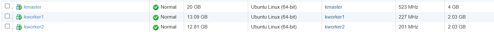

---

### 02 Ubuntu First Boot
First boot console on kmaster showing hostname and cloud-init completion.

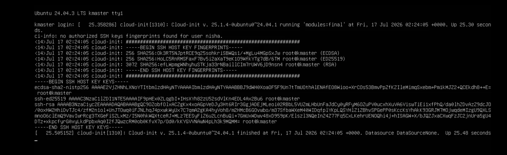

---

### 03 Static IPs Confirmed
`ip addr show` on each node confirming IP assignment. Netplan is configured
with `dhcp4: false` on interface `ens160`. Ubuntu 24.04 may label the
address as `dynamic` in kernel output even with a static netplan config.
Stability is confirmed by consistent IPs across reboots.

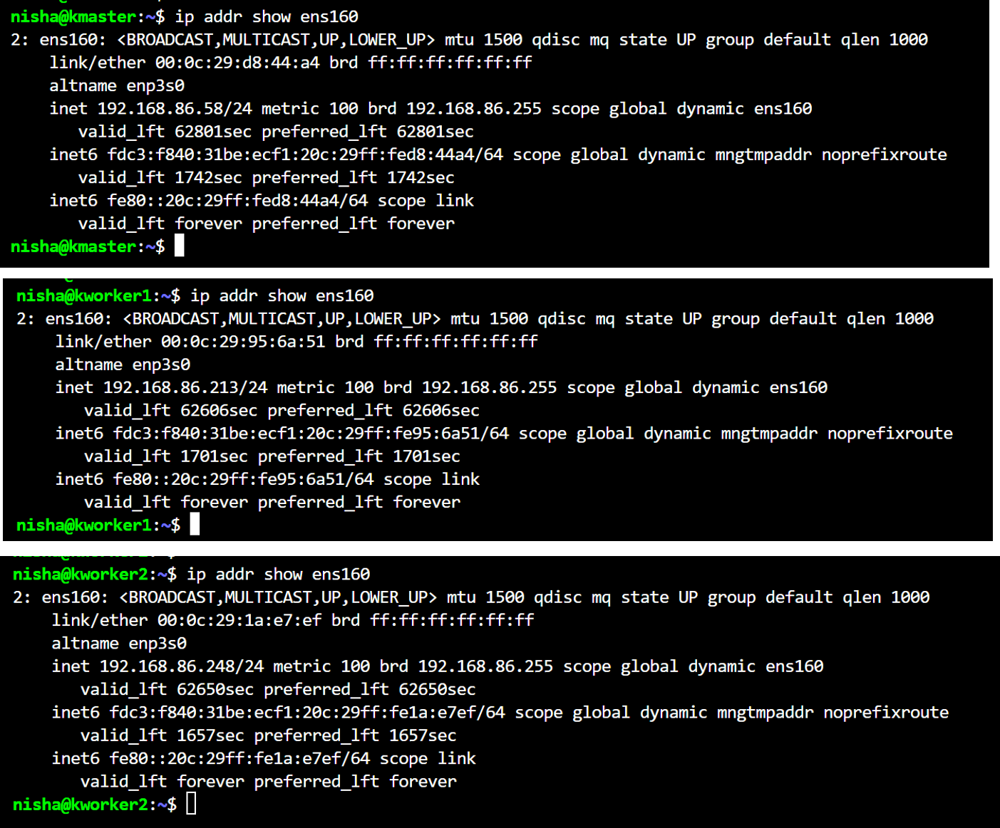

---

### 04 Swap Disabled
Output of `free -h` on all 3 nodes confirming `Swap: 0B 0B 0B`.

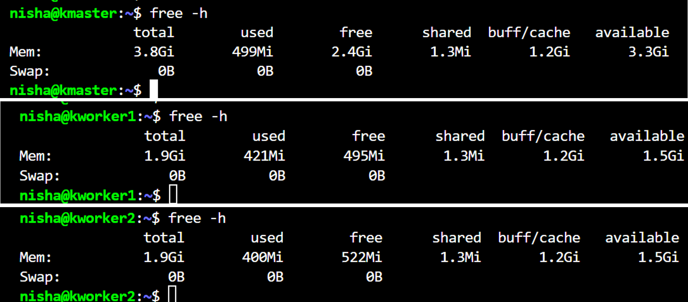

---

### 05 containerd Active
`systemctl status containerd` showing `active (running)` with SystemdCgroup enabled.

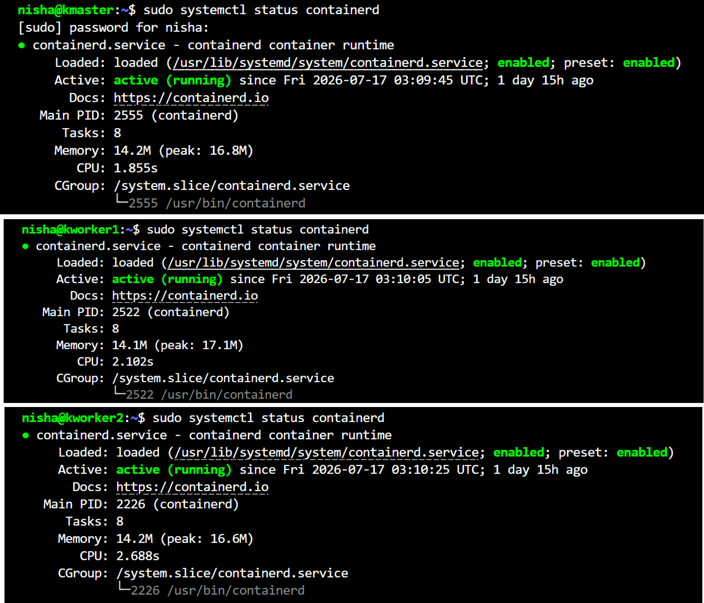

---

### 06 kubeadm Version
`kubeadm version` confirming v1.31.14 across all nodes.

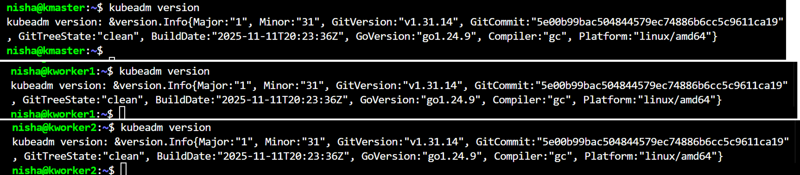

---

### 07 kubeadm init Success
Full output of `kubeadm init` on kmaster ending with control-plane initialization confirmed.

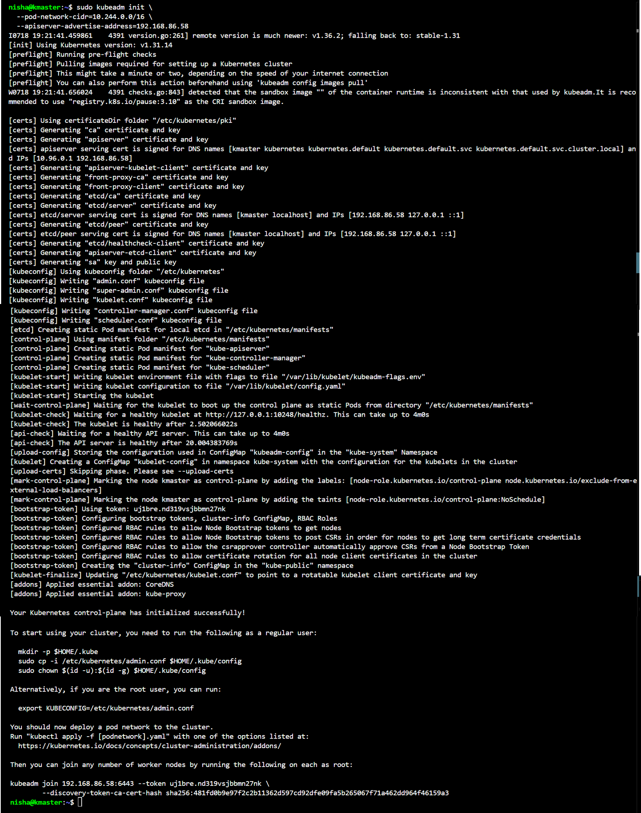

---

### 08 Calico CNI Installed
`kubectl get nodes` showing kmaster in `Ready` state after Calico installation.

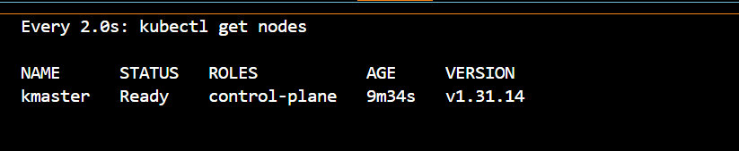

---

### 09 Workers Joined
`kubeadm join` output on kworker1 and kworker2 completing successfully.

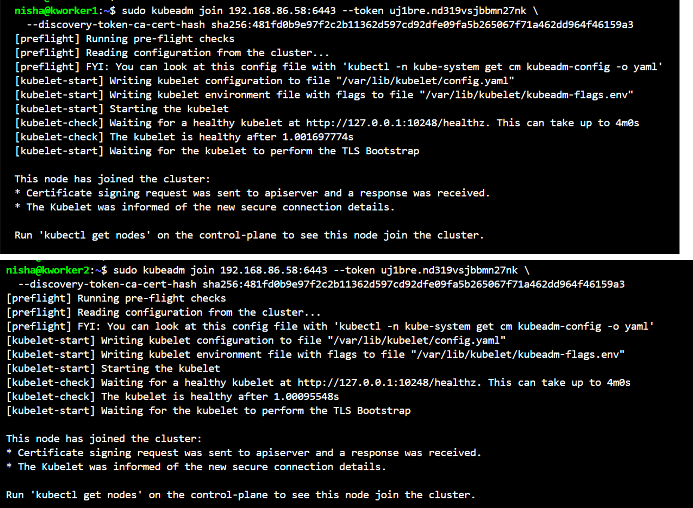

---

## Cluster Verification

### 10 All Nodes Ready
`kubectl get nodes` confirming all 3 nodes in `Ready` state at v1.31.14.

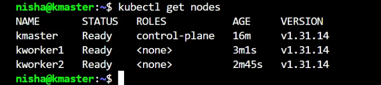

---

### 11 Control Plane Pods Running
`kubectl get pods -n kube-system` showing all system pods in `Running` state with 0 restarts.

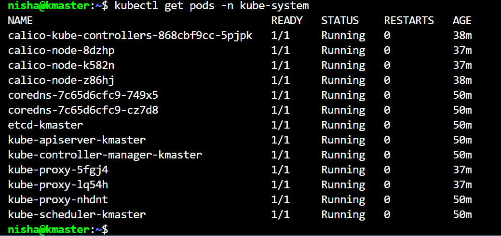

---

### 12 Cluster Info
`kubectl cluster-info` showing API server endpoint at `https://192.168.86.58:6443`.

---

### 13 First Workload with Correct Pod CIDR
`kubectl get pods -o wide` showing nginx pods distributed across worker nodes with IPs in the `10.244.x.x` range, confirming the correct pod CIDR is active.

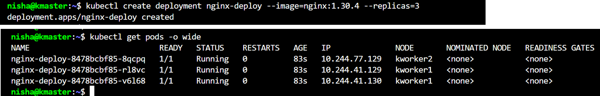

---

### 14 Rolling Update
`kubectl rollout status` output confirming zero-downtime rolling update from nginx 1.30.4 to 1.31.3.

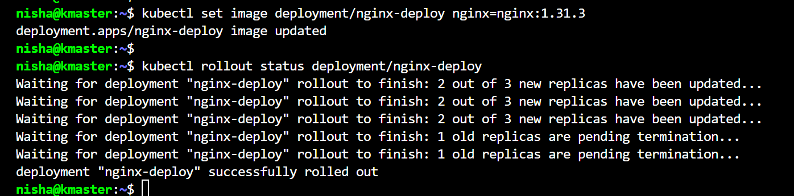

---

## Troubleshooting Evidence

Screenshots documenting real errors encountered and resolved during the lab build.
Full root cause analysis and fix in `docs/03-troubleshooting-logs/lab-build-errors.md`.

---

### Error 5A: kubelet Crash Loop
`systemctl status kubelet` showing activating (auto-restart) with exit-code failure after swap re-enabled on reboot.

---

### Error 5B: API Server Unreachable
`kubectl get nodes` returning connection refused while kubelet was down.

---

### Error 5C: All Containers Exited
`crictl ps -a` showing all control plane containers in Exited state.

---

### Error 5D: Root Cause Confirmed
`journalctl -u kubelet` showing swap detected, kubelet refuses to start.

Full root cause analysis and fix documented in `docs/03-troubleshooting-logs/lab-build-errors.md`.
